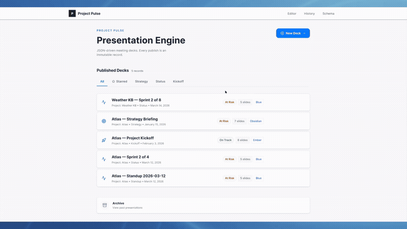
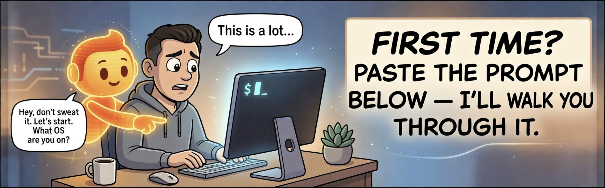

# Pulse

**The publishing layer for your personal OS.**

Your vault captures the work. Pulse transforms it into whatever the moment requires.

You've automated your projects, tasks, and tracking in a markdown vault using tools like [Dex](https://github.com/davekilleen/Dex) or [Claude Chief of Staff](https://github.com/mimurchison/claude-chief-of-staff). But when it's time to share the work — a status deck for your VP, a standup for your team, a LinkedIn post from a project insight — you're still copying and pasting into other tools.

Pulse is the last mile. Run a skill, get the artifact.

```
/pulse-status my-project     → slide deck appears in the browser
/pulse-linkedin my-project   → LinkedIn post, ready to publish
```

Your vault data becomes navigable slide decks, structured social posts, and more — with speaker notes, keyboard shortcuts, themed layouts, and zero copy-paste. With the MCP server enabled, artifacts just *appear*.



**Tech stack:** Next.js 14 · React 18 · SQLite (Prisma) · Tailwind CSS · Framer Motion · Zod

---

## Table of Contents

- [Who This Is For](#who-this-is-for)
- [What You Get](#what-you-get)
- [Before You Install](#before-you-install)
- [Quick Start for Dex Users](#quick-start-for-dex-users-60-seconds)
- [Guided Install](#guided-install)
- [MCP — Automatic Artifact Delivery](#mcp--automatic-artifact-delivery)
- [The Skills](#the-skills)
- [Themes](#themes)
- [MISSING Slides](#missing-slides)
- [Keyboard Shortcuts](#keyboard-shortcuts)
- [The LinkedIn Skill](#the-linkedin-skill)
- [Roadmap](#roadmap)
- [Contributing](#contributing)
- [Related Projects](#related-projects)
- [Credits & License](#credits--license)

---

## Who This Is For

Pulse is built for people who already run an AI-powered personal operating system — a vault of markdown files managed through [Claude Code](https://claude.ai/download) or [Cursor](https://cursor.com), with project folders, sprint plans, and task tracking.

**To generate your own artifacts, you need:**

- A vault or project folder with markdown files
- Claude Code or Cursor to run the skills
- Pulse running locally to render the output

Pulse is an add-on to an existing AI workflow. Without a vault and Claude Code, you can explore the demo decks but you can't generate your own.

### New to all of this?

If the concept resonates but you don't have a vault set up yet, start here:

1. **[Dex](https://github.com/davekilleen/Dex)** — the most popular AI Chief of Staff. Sets up a full personal OS with task tracking, meeting prep, and MCP servers. Free, open source, Mac and Windows. Pulse was designed to work alongside it.
2. **[Claude Code](https://claude.ai/download)** — the AI terminal that executes Pulse skills.

Get Dex running first. Once you have projects in your vault and Claude Code on your machine, come back here.

---

## What You Get

Pulse ships ready to explore. On first launch, you'll see four **Atlas** demo decks and one **Atlas LinkedIn post** — a single fictional project moving through its full lifecycle:

| Skill | Artifact | The Output |
|---|---|---|
| `/pulse-strategy` | Deck | Obsidian-themed briefing — pitching the VP on why Atlas needs to happen |
| `/pulse-kickoff` | Deck | Ember-themed kickoff — aligning the execution team after approval |
| `/pulse-status` | Deck | Blue-themed status — Week 5, migration on track, review sessions slipping |
| `/pulse-standup` | Deck | Blue-themed standup — Day 8, clearing the review backlog before it compounds |
| `/pulse-linkedin` | LinkedIn Post | A post sharing the Week 5 documentation results with your network |

Click through all five. You'll see how the same project data tells a different story depending on who's in the room and what the format demands. You don't need a vault to explore the demos — just install Pulse and browse.

Under the hood:

- **5 skills** — status, strategy, standup, kickoff, and LinkedIn posts
- **2 artifact types** — slide decks and LinkedIn posts, with more on the way
- **3 themes** — Blue, Obsidian, Ember
- **14 slide types** — hero, context, problem, evidence, framework, roadmap, grid, pipeline, timeline, kpis, blockers, and more
- **MCP server** — skills push artifacts directly to Pulse, no clipboard involved
- **MISSING slides** — when data is absent, Pulse tells you what to add instead of making something up

---

## Before You Install

Pulse has two requirements that aren't obvious from the repo:

**1. You need a vault.** Pulse reads your project files to generate artifacts. Without a vault — a folder of markdown files managed through Claude Code — there's nothing to transform. If you don't have one yet, start with [Dex](https://github.com/davekilleen/Dex) and come back.

**2. Pulse runs in its own terminal.** Pulse is a local web app (`localhost:3000`). It needs to be running at the same time as Claude Code for MCP artifact delivery to work. That means two terminals:

```
Your work happens here              Leave this running
────────────────────────             ─────────────────
Claude Code                          Pulse
/pulse-status my-project             npm run dev
       ↓                                ↑
       └── skill pushes artifact ──→ MCP server receives
```

If Pulse isn't running when a skill fires, the JSON saves to your project folder as a fallback. No work is lost — start Pulse later and re-push.

---

## Quick Start for Dex Users (60 Seconds)

You already have Node, Git, Python, Claude Code, and MCP servers running. Here's the fast track:

```bash
git clone https://github.com/machovato/pulse.git
cd pulse
npm install
npm run setup    # point it at your vault when prompted
npm run dev
```

Open `http://localhost:3000`. Four Atlas demo decks and one LinkedIn post are ready to explore.

If you provide your vault path during setup, Pulse copies the skills and registers the MCP server. Restart Claude Code, then:

```
/pulse-standup my-project
```

The deck appears in Pulse. No paste, no switching windows.

---



## Guided Install

If the quick start above doesn't match your setup — or you'd rather have a guide walk you through it — paste this into Claude Code or Claude Chat:

> You are the Pulse Repo Concierge — my friendly, patient guide who installs Pulse step-by-step like a friend sitting next to me.
>
> Pulse is the publishing layer for a personal OS. It transforms project vault data into slide decks, LinkedIn posts, and other artifacts that appear in the browser. Repo: https://github.com/machovato/pulse
>
> Rules:
> - Start by asking what OS I'm on (Mac, Windows, or Linux)
> - Go ONE STEP AT A TIME. Never list all steps at once.
> - Before anything else, ask: "Do you have a markdown vault — a folder of project files managed through Claude Code or Cursor?" If no, direct them to set up Dex first (https://github.com/davekilleen/Dex) and come back. Don't proceed without a vault.
> - Check for Git, Node.js, and Python first. If Python is missing, install it before proceeding — don't skip it. It's required for build tools on some systems.
> - Then guide: clone → npm install → npm run setup → npm run dev
> - Before telling the user to run `npm run setup`, explain what MCP is in plain English (automatic artifact delivery, no copy-paste) and ask if they want it. Don't let them hit the MCP prompt in setup without context.
> - After every command, ask "Did that work? Paste any error if not" and fix it before continuing.
> - When `npm run dev` succeeds, explicitly say: "Keep this terminal open. Pulse needs to stay running at localhost:3000 while you use it. Open a second terminal for Claude Code." Clarify that skills are typed in Claude Code's chat interface, not in the terminal directly — the second terminal just keeps Claude Code running.
> - If I skip MCP, show me how to use Pulse with manual copy-paste instead.
> - End by verifying: demo decks visible at localhost:3000, and if MCP is set up, one skill delivers an artifact with both terminals running.
>
> Begin!

Claude will ask about your OS, check your prerequisites, walk you through every step, and troubleshoot anything that goes wrong — all tailored to your machine.

For reference, the manual steps are: `git clone` → `npm install` → `npm run setup` → `npm run dev`. See `docs/TROUBLESHOOTING.md` if you prefer to debug on your own.

---

## MCP — Automatic Artifact Delivery

**Without MCP:**
```
Run skill → open JSON file → copy → open Pulse → paste → save → view
```

**With MCP:**
```
Run skill → artifact appears in Pulse
```

Seven steps become two. For daily standups, that's the difference between "I should use this" and "I can't stop using this."

The MCP server is set up automatically during `npm run setup` if you provide your vault path. To verify it's working, type `/mcp` in Claude Code and look for:

```
pulse · ✅ connected
```

Pulse must be running in its own terminal (`npm run dev`) for delivery to work. If Pulse isn't running, the skill saves the JSON file as a fallback. See [Before You Install](#before-you-install) for the two-terminal setup.

---

## The Skills

Each skill reads your project files and generates a specific artifact. Think of them like lenses — same project, different output depending on who's in the room and what the moment requires.

| Skill | Use Case | Leash |
|---|---|---|
| `/pulse-status` | Weekly project update | Medium — cites everything, no editorial spin |
| `/pulse-strategy` | Leadership briefing | Long — synthesizes patterns, builds a narrative |
| `/pulse-standup` | Daily standup | Short — yesterday, today, blockers. That's it. |
| `/pulse-kickoff` | Project launch | Shortest — charter-bound, nothing beyond the doc |
| `/pulse-linkedin` | Share a project insight on LinkedIn | Medium — extracts real insights, filtered through your voice file |

**"Leash"** is how much interpretation a skill is allowed. Short leash = stick tightly to the source files. Long leash = synthesize across them and build a story. Every skill follows the cardinal rule: **no invention.** If the data isn't there, the slide says [MISSING], not something that sounds plausible. If the insight isn't genuinely interesting, the LinkedIn skill tells you instead of posting anyway.

---

## Themes

Three built-in themes. Each one sets a different tone.

**Blue** (default) — Clean, light, professional. The workhorse. Good for any meeting where you want the data to speak.

**Obsidian** — Dark, high-contrast, boardroom-ready. For strategy decks where the room should lean forward.

**Ember** — Warm, collaborative, energetic. For kickoffs where you want the room to feel invited, not briefed.

Themes are set in the deck JSON (`meta.theme`) or from the editor dropdown. If no theme is specified, Blue applies automatically.

---

## MISSING Slides

When a skill can't find data for a slide, it doesn't guess. It shows a **MISSING slide** — a placeholder that tells you exactly what to add.

> **Project Timeline**
>
> No sprint dates or milestones found in project files.
>
> Add a timeline or sprint schedule to your project folder to populate this slide.

**The output teaches the input.** You run the skill, see what's missing, improve your vault, run it again. Over time, your project documentation gets better because Pulse keeps gently pointing at the gaps.

---

## Keyboard Shortcuts

| Key | Action |
|---|---|
| `← → ↑ ↓` | Navigate slides |
| `E` | Edit this slide |
| `Shift + E` | Edit full deck JSON |
| `N` | Toggle speaker notes |
| `G` / `O` | Slide grid overview |
| `D` | Toggle density |
| `P` | Print / export |
| `Esc` | Dismiss overlay / return home |

---

## The LinkedIn Skill

Pulse isn't just for decks. The `/pulse-linkedin` skill turns any project folder into a publish-ready LinkedIn post — grounded in what you actually built, not what you remember to summarize.

```
/pulse-linkedin my-project
```

The skill reads your project files, extracts 3–5 content themes with hook seeds and pillar mapping, waits for you to pick one, then runs a three-pass pipeline against your personal voice profile. The result pushes to Pulse via MCP and renders at `/posts/[id]`.


**Key design decisions:**

- **Hook-first** — the opening line is written for the mobile fold constraint, not trimmed to fit after the fact. If the hook doesn't earn the scroll, the rest doesn't matter.
- **Voice file as tiebreaker** — your writing examples override LinkedIn best practices. The post should sound like you, not like a thought leader template.
- **Post memory** — tracks previously used angles in `published.md` to prevent theme repetition across posts.
- **Relevancy gate** — runs silently before writing. If the selected angle is too navel-gazing for your audience, the skill redirects before investing in a draft.

To use the LinkedIn skill, you need two files in your vault: `linkedin-voice.md` (your writing examples and anti-patterns) and `published.md` (an empty log the skill appends to after every run). Both are installed automatically during setup. To customize your voice file, click **"Customize your voice"** in the post editor — it gives you a prompt that walks you through a 5-minute interview in Claude Code. See `skills/pulse-linkedin/SKILL.md` for the full skill reference.

---

## Roadmap

### Shipped

- Five skills: status, strategy, standup, kickoff, LinkedIn posts
- Two artifact types: slide decks and LinkedIn posts
- Three themes: Blue, Obsidian, Ember
- 14 slide types with Zod validation
- MCP server for zero-click artifact delivery
- MISSING slide placeholders
- Inline editor with keyboard shortcuts
- Speaker notes, density toggle, print/export
- Atlas demo artifacts (4 decks + 1 LinkedIn post) showing a full project lifecycle

### Planned

- **MCP upsert** — run the same skill twice without duplicating the artifact
- **Slug URLs** — `/deck/atlas-strategy` instead of `/deck/cmmqhlh0b0003...`
- **Retrospective skill** — went well, improve, action items
- **PDF export** — direct generation without print dialog
- **New surfaces** — if your vault has the data and the moment calls for it, Pulse should render it. More formats ahead.

---

## Contributing

Pulse is open source and MIT licensed.

**Prompters & workflow designers** → build new **skills**. See the `skills/` folder for the pattern. Deck skills and content skills follow the same structure.

**Want the easiest first contribution?** → add a **theme**. Drop a CSS file in `public/themes/`. See `docs/THEME-PLAYBOOK.md`.

**React/TypeScript developers** → build new **renderers**. See `SCHEMA.md` for slide types.

---

## Related Projects

| Project | Author | What It Does |
|---|---|---|
| [Dex](https://github.com/davekilleen/Dex) | Dave Killeen | AI Chief of Staff — personal OS for 25+ roles |
| [Claude Chief of Staff](https://github.com/mimurchison/claude-chief-of-staff) | Mike Murchison | CEO-oriented AI OS with inbox triage and relationship CRM |
| [AI Chief of Staff](https://github.com/tomochang/ai-chief-of-staff) | Tomo Chang | VP-oriented AI OS with multi-channel triage |

Pulse is the publishing layer these systems don't have.

---

## Credits & License

Built by Tony Melendez. Inspired by [Dave Killeen's Dex](https://github.com/davekilleen/Dex) and the AI Chief of Staff community.

Designed in Claude Chat. Built with Claude Code and Gemini. Powered by Next.js, Framer Motion, Prisma, and Zod.

Released under the MIT License. See `LICENSE` for details.
